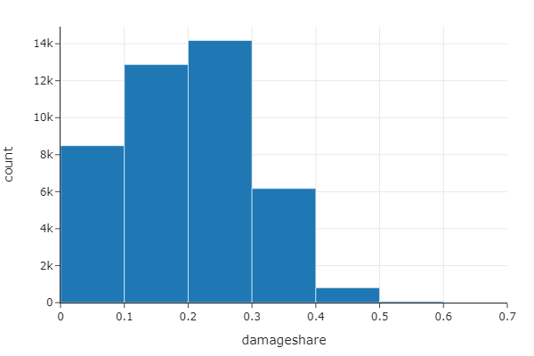
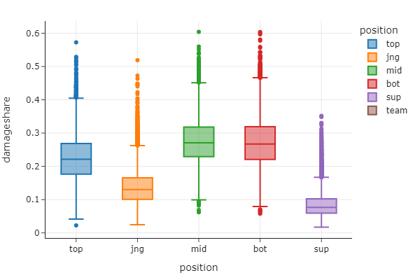
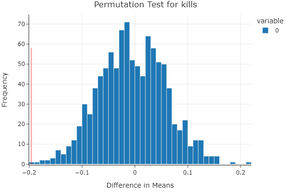
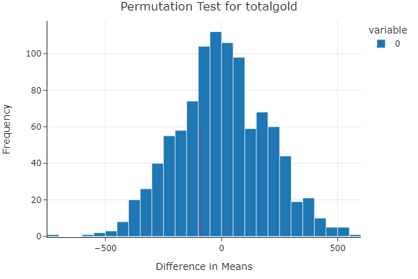
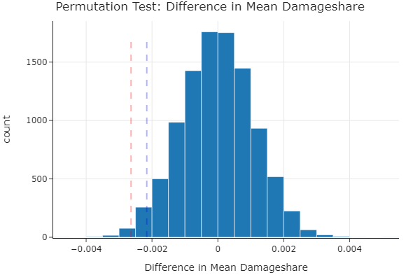
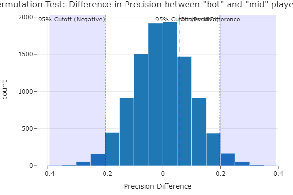

# Introduction
In the world of competitive gaming, particularly in League of Legends, understanding which roles most significantly impact the outcome of matches is crucial for players, teams, and analysts. Our project, part of the final assessment for the DSC80 course, delves into this question: Which role, ADC (Attack Damage Carry) or Mid Laner, tends to have a more significant impact on the game outcome in matches?

To explore this, we analyzed a comprehensive dataset of League of Legends matches, consisting of more than 15,000 rows. Key columns relevant to our inquiry include:

Role: Indicates the assigned role of the player (e.g., ADC, Mid Laner).
 - Kills: The number of kills a player secures during the match.
 - Deaths: The number of times a player is killed.
 - Assists: The number of assists a player contributes to.
 - Gold Earned: The total amount of gold a player accumulates.
 - Win: A binary indicator showing whether the player's team won the match.
These columns help us measure and compare the performance and impact of ADCs and Mid Laners in determining match outcomes. Readers should care about this analysis as it offers insights into strategic gameplay and role prioritization, which are essential for optimizing team performance and success.

# Data Cleaning and Exploratory Data Analysis
For the sake of this project we will only use the most important columns that are relevant to our research, these are:

| Column Name         | Description                                                                                                         |
|---------------------|---------------------------------------------------------------------------------------------------------------------|
| `gameid`            | Unique identifier for each game.                                                                                   |
| `datacompleteness`  | Indicator of whether the data for the game is complete.                                                            |
| `position`          | Player's position in the game (e.g., bot, mid, top, jungle, support).                                              |
| `result`            | Outcome of the game for the player (win or loss).                                                                  |
| `kills`             | Number of kills by the player during the game.                                                                     |
| `deaths`            | Number of times the player died during the game.                                                                   |
| `assists`           | Number of assists by the player during the game.                                                                   |
| `damagetochampions` | Total damage dealt by the player to enemy champions.                                                               |
| `dpm`               | Damage per minute, indicating how much damage the player deals on average per minute.                              |
| `visionscore`       | A score indicating the player's contribution to vision control through wards and vision denial.                    |
| `golddiffat15`      | Gold difference at 15 minutes compared to the opposing player in the same position.                                |
| `csdiffat15`        | Creep score (minion kills) difference at 15 minutes compared to the opposing player in the same position.          |
| `killsat15`         | Number of kills by the player at 15 minutes into the game.                                                         |
| `xpdiffat15`        | Experience difference at 15 minutes compared to the opposing player in the same position.                          |
| `firstblood`        | Indicator if the player or their team got the first kill of the game.                                              |
| `damageshare`       | Percentage of the team's total damage dealt to champions contributed by the player.                                |
| `killsat15`         | Number of kills by the player at 15 minutes into the game. (Repeated to indicate importance in different contexts) |
| `assistsat15`       | Number of assists by the player at 15 minutes into the game.                                                       |
| `deathsat15`        | Number of deaths by the player at 15 minutes into the game.                                                        |
| `csat15`            | Creep score (minion kills) by the player at 15 minutes into the game.                                              |
| `xpat15`            | Experience points gained by the player at 15 minutes into the game.                                                |

## Univariate Analysis of Damage Share

The histogram depicts the distribution of damageshare among players in a League of Legends dataset, showing how much each player contributes to their team's total damage dealt to champions. Most players fall within the 10% to 30% range, indicating a common spread where individual contributions are significant but balanced. The sharp decline beyond 30% suggests fewer players are heavily skewed towards dominating their team's damage output, likely highlighting roles such as ADCs or mid-laners who are primary damage dealers. This distribution reflects typical team dynamics where damage is moderately shared among key roles, ensuring versatility and resilience in gameplay.

## Bivariate Analysis between position and damage share

This box plot illustrates the damageshare distribution across different positions in League of Legends: top, jungle (jng), mid, bot, and support (sup). The mid and bot positions show higher median damageshare, around 0.25, indicating they often contribute significantly to the team's total damage. The jungle position typically has a lower median damageshare near 0.15, reflecting their broader role in map control and objective play rather than direct damage dealing. Supports have the lowest median damageshare and a narrower range, focusing more on utility and protection than damage output. The top lane position displays a moderate damageshare, with a median around 0.20, highlighting a balanced role between damage and tanking or split-pushing. This plot underscores the distinct roles and expected damage contributions of each position within a team.

## Instresting aggregates and pivots
In order to get a full understanding of the data we are given lets work with a few pivots, this will help us get a better understanding of the game, and might lead us to future projects.

| Position | Assists | Damage Share | Deaths | Kills | Total Gold |
|----------|---------|--------------|--------|-------|------------|
| bot      | 5.60    | 0.27         | 2.58   | 4.51  | 13876.32   |
| jng      | 7.82    | 0.14         | 3.14   | 2.56  | 10916.34   |
| mid      | 6.20    | 0.28         | 2.61   | 3.69  | 13301.80   |
| sup      | 9.75    | 0.09         | 3.33   | 0.91  | 8372.47    |
| top      | 5.06    | 0.23         | 2.87   | 2.82  | 12532.96   |

# Assessment of Missingness
In this step, we're investigating the missing values in the `xpdiffat15` column of our League of Legends dataset. The idea is to determine if the missingness is systematically related to other gameplay metrics, which could suggest that the missing data is not random (potentially Missing Not at Random, or MNAR). We create a new column xpdiffat15_missing to flag the missing values. Then, we perform permutation tests on various columns (kills, deaths, assists, and totalgold) to see if there's a significant difference in their means between games with and without missing xpdiffat15. This involves shuffling the data and comparing the observed differences with these random permutations to compute p-values, helping us understand if the observed differences are statistically significant or likely due to chance.

## Permutation test with 'xpdiffat15' and 'kills' columns
***Null Hypothesis (H0):*** The missingness of xpdiffat15 is independent of the kills column. In other words, any observed difference in means between the missing and non-missing groups for xpdiffat15 is due to random chance.

***Alternative Hypothesis (H1):*** The missingness of xpdiffat15 is dependent on the kills column. This means that the observed difference in means between the missing and non-missing groups for xpdiffat15 is not due to random chance and indicates a significant relationship between the two variables.

The histogram represents the distribution of the difference in means obtained from the permutation tests, illustrating the null hypothesis that there's no relationship between the missingness of xpdiffat15 and kills. The red dashed line indicates the actual observed difference in means, and its position outside the bulk of the distribution suggests a significant dependency between these variables. This implies that the observed difference is unlikely to have occurred by chance, confirming a significant relationship.

## Permutation test with 'xpdiffat15' and 'totalgold' columns
***Null Hypothesis (H0):*** The missingness of xpdiffat15 is independent of the totalgold column. Any observed difference in means between the missing and non-missing groups for xpdiffat15 is due to random chance.

***Alternative Hypothesis (H1):*** The missingness of xpdiffat15 is dependent on the totalgold column. The observed difference in means between the missing and non-missing groups for xpdiffat15 is not due to random chance and indicates a significant relationship.

The histogram represents the distribution of the difference in means obtained from the permutation tests, illustrating the null hypothesis that there's no relationship between the missingness of xpdiffat15 and totalgold. The red dashed line indicates the actual observed difference in means, and its position outside the bulk of the distribution suggests a significant dependency between these variables. This implies that the observed difference is unlikely to have occurred by chance, confirming a significant relationship.

# Hypothesis Testing
Hypothesis testing is crucial in a project because it provides a structured method to make decisions based on data, rather than intuition or assumption. It allows us to test the validity of a claim or theory using sample data and statistical methods, thereby quantifying the probability that the observed effects are due to chance. This process helps ensure that project decisions and conclusions are evidence-based and statistically valid, reducing the risk of erroneous conclusions that could lead to ineffective or costly actions.

**Null Hypothesis (H0)**: There is no difference in mean damageshare between ADCs and Mid Laners.

**Alternative Hypothesis (H1)**: There is a difference in mean damageshare between ADCs and Mid Laners.

The hypothesis test was conducted to determine if there is a significant difference in mean damageshare between ADCs and Mid Laners in high-stakes matches. The **observed difference** in mean damageshare was approximately **-0.0026**. The **p-value** obtained from the permutation test was **0.0153**.
Since the p-value is less than the **significance level of 0.05**, we **reject the null hypothesis**. This indicates that there is a statistically significant difference in mean damageshare between ADCs and Mid Laners in high-stakes matches.

In simpler terms, our analysis shows that the average damageshare contribution by ADCs and Mid Laners is not the same in mathches, with a noticeable, albeit small, difference between the two roles.

**Null Hypothesis (H0)**: There is no difference in the mean performance metrics (such as damageshare, kills, assists) between ADCs/Mid Laners and all other roles.

**Alternative Hypothesis (H1)**: There is a difference in the mean performance metrics between ADCs/Mid Laners and all other roles.

| Metric      | t-Statistic | p-Value  | Decision   |
|-------------|-------------|----------|------------|
| Damageshare | 166.75      | 3.00e-04 | Reject H0  |
| Kills       | 72.92       | 6.86e-04 | Reject H0  |
| Assists     | -37.27      | 1.34e-03 | Reject H0  |

For each of the performance metrics (damageshare, kills, assists), the p-values are significantly lower than the commonly used significance level of 0.05. This leads us to **reject the null hypothesis for all three metrics**.

This means there is strong statistical evidence to support the alternative hypothesis that the mean performance metrics (damageshare, kills, assists) between ADCs/Mid Laners and all other roles are significantly different.

# Framing a Prediction problem
The goal of this project is to build a classification model to predict the outcome of a League of Legends (LoL) game based on key metrics collected during the first 15 minutes of gameplay. Specifically, we will focus on the core positions of ADC (bot lane) and Midlane (mid), as their performance is often crucial to the overall success of the team. For the purpose of this model we will only work with complete data.

**Key Metrics:**
The key metrics for ADC (bot) and Midlane (mid) positions that will be used in our classification model are:

 * Experience Points (XP): Total experience points accumulated.
 * Kills: Number of enemy champions killed.
 * Deaths: Number of times the player died.
 * Assists: Number of assists made by the player.
 * Total Gold: Total gold accumulated.
 * Target Variable:

**The target variable for our classification model will be the game outcome, which can be binary:**

 * Win: The team wins the game.
 * Loss: The team loses the game.

**Data Preprocessing:**
 * Feature Selection: Extracting relevant features for ADC and Midlane positions.
 * Feature Engineering: Creating new features that may enhance model performance.
 * Normalization: Scaling the features to a standard range to ensure model convergence and stability.

**Decision Tree Classifier**

A Decision Tree Classifier is a versatile and widely-used machine learning algorithm for classification tasks. It works by splitting the data into subsets based on the value of input features. Each internal node of the tree represents a "decision" based on one of the input features, and each leaf node represents a classification label (in this case, win or loss).

# Baseline model
**Step 1: Feature Selection**

Goal: Extract relevant features for ADC and Midlane positions, these features for our purposes will be bot_exp_15, bot_kills_15, bot_death_15, bot_assists_15, mid_exp_15, mid_kills_15, mid_death_15, mid_assists_15

**Step 2: Normalization**

Goal: Scale the features to ensure that they are on a comparable scale, which can help in model convergence and stability. Instead of using sklearn library we will build our own standartizer.

**Step 3: Model Training**

Goal: Train a decision tree classifier using the selected and normalized features.

*Step 3.1: Train-Test Split*

 * Split the dataset into training and testing sets. Typically, a 70-30 or 80-20 split is used.
 * The training set is used to train the model, while the testing set is used to evaluate its performance.

*Step 3.2: Training the Decision Tree Classifier*

 * Use the training set to fit the decision tree classifier. The algorithm will create a tree structure by splitting the data at various points based on the input features to minimize classification error.

**Step 4: Evaluating the model**

Goal: evaluate the accuracy and other evaluation metrics on the model to determine validity of the model.

**Evaluation Results**
Accuracy: 0.5365480290853425
Precision: 0.55320813771518
Recall: 0.5248700816629547
F1 Score: 0.5386666666666666

### Coclusion for Baseline Model
The current model for predicting League of Legends game outcomes has an accuracy of 53.65%, meaning it is only slightly better than guessing. This suggests there is room for improvement. To make the model better, we can create new features, adjust the model settings, and try advanced methods. Additionally, balancing the dataset and increasing its size can help. These steps should improve the model's accuracy and reliability.

The baseline model for predicting the outcome of a League of Legends (LoL) game based on early-game performance metrics has demonstrated foundational success, yet there is ample room for enhancement. The use of a Decision Tree Classifier has yielded modest predictive accuracy and other performance metrics, highlighting the necessity for a more robust approach in our final model.

# Final Model
For the final model, transitioning to a Random Trees classifier will likely yield improvements due to its capacity to handle overfitting better than a single decision tree, thereby enhancing generalization to unseen data. Furthermore, the incorporation of GridSearch will be pivotal. This technique will allow us to systematically work through multiple combinations of parameter tunes, determine which tune gives the best performance and thus optimize our model for accuracy and reliability.

Additionally, the baseline model will be expanded to include four more features, which should enhance the model's ability to capture the complexity and nuances of game dynamics. These additional features will be carefully selected to ensure they are predictive of game outcomes, possibly focusing on metrics such as objective control (like dragons and turrets), vision scores, or player efficiency ratings, which could provide deeper insights into game progress and team performance dynamics.

**Random Forest Classifier**
A Random Forest Classifier is an ensemble learning method for classification that operates by constructing a multitude of decision trees at training time. For classification tasks, the output of the random forest is the class selected by most trees. This method is effective due to its ability to limit overfitting without substantially increasing error due to bias.

## Final Model Steps

**Step 1: Data Cleaning**

* Ensure data completeness by filtering rows specifically marked as 'complete'.
* Remove any rows with missing values to maintain data integrity.

**Step 2: Feature Processing**

* Implement manual one-hot encoding for the 'position' feature to convert categorical data into numeric format, which is suitable for model input.
* Standardize the numeric features to have a mean of zero and a standard deviation of one, optimizing model performance.

**Step 3: Model Training**

* **Train-Test Split**: Segment the data into training (80%) and testing (20%) sets to evaluate the model's performance on unseen data.
* **Training the RandomForest Classifier**: Utilize the training set to fit the model. This step involves adjusting several hyperparameters to refine the model's prediction capabilities.

**Step 4: Model Evaluation**

* Utilize accuracy, precision, recall, and F1 score to assess the model. These metrics provide a comprehensive view of performance, highlighting the model's strengths and areas for improvement.

**Performance Results:**
* Accuracy: Computed as the ratio of correctly predicted instances to the total instances.
* Precision: Measures the accuracy of positive predictions.
* Recall: Captures the ability to find all relevant instances in the dataset.
* F1 Score: Harmonic mean of precision and recall, providing a balance between the two.

**Evaluation Results**
Accuracy: 0.6383467278989667
Precision: 0.659270998415214
Recall: 0.6176688938381588
F1 Score: 0.6377922575699502

# Fairness Analysis
In machine learning, it's crucial to ensure that models perform equitably across different groups to avoid biased outcomes. In this analysis, we examine whether our model's precision differs significantly between two player positions: "bot" and "mid". By focusing on these groups, we aim to identify if the model favors one position over the other in predicting game victories. To evaluate fairness, we conduct a permutation test to compare the model's precision for "bot" and "mid" players. This approach helps us understand if any observed differences in precision are due to the model's inherent bias or just random chance.

#### Group Definitions:

- **Group X**: "Bot" players (players in the "bot" position).
- **Group Y**: "Mid" players (players in the "mid" position).

#### Evaluation Metric:

- **Precision**: The ratio of true positive predictions to the total number of positive predictions (true positives and false positives). Precision evaluates how accurate the positive predictions are.

#### Hypotheses:

- **Null Hypothesis (\(H_0\))**: The model's precision is the same for "bot" and "mid" players. Any observed differences in precision are due to random chance.
- **Alternative Hypothesis (\(H_1\))**: The model's precision for "bot" players is significantly different from that for "mid" players.

#### Test Statistic:

- **Difference in Precision**: The precision difference between "bot" and "mid" players, calculated as \( \text{Precision}_{\text{bot}} - \text{Precision}_{\text{mid}} \).

#### Significance Level:

- **\(\alpha = 0.05\)**: We use a significance level of 0.05 to assess the statistical significance of the observed difference in precision.

### Results:

- **Precision for "Bot" Players**: \(0.689\)
- **Precision for "Mid" Players**: \(0.632\)
- **Observed Difference in Precision**: \(0.0575\)
- **P-value**: \(0.0404\)

### Visualization:

### Conclusion:

The fairness analysis reveals a significant difference in precision between "bot" and "mid" players, with the p-value (\(0.0404\)) being less than the significance level (\(0.05\)). This result leads us to reject the null hypothesis, indicating that the precision of the model is not the same for both groups. Specifically, the model demonstrates higher precision for "bot" players compared to "mid" players, suggesting a performance bias in favor of "bot" players.

### Implications:

1. **Model Bias**: The significant precision difference suggests that the model is more accurate in predicting victories for "bot" players than for "mid" players. This could lead to unfair treatment or inaccurate assessments depending on the player's position.
2. **Model Adjustments**: To address this bias, consider revisiting the model's training process, feature selection, and potentially rebalancing the dataset to ensure more equitable treatment across positions.
3. **Broader Performance Metrics**: Evaluate additional performance metrics, such as recall or balanced accuracy, to gain a comprehensive understanding of the model's fairness and overall performance.
4. **Investigate Causes**: Further analysis is needed to understand why the model performs differently for these groups. This could involve exploring feature importance, model decision boundaries, or looking into whether the data itself introduces some biases.

